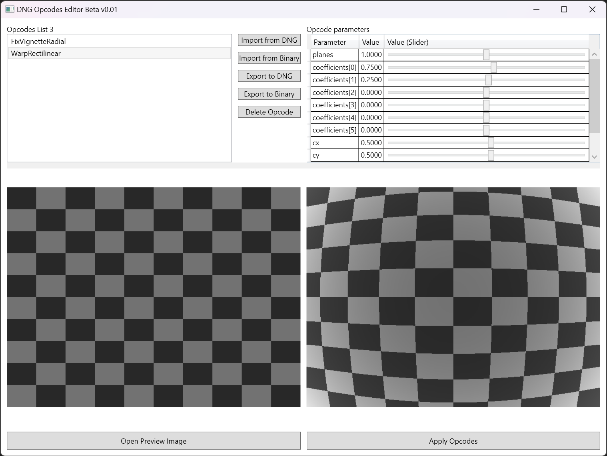

# Dng Opcodes Editor

Read, Write and Preview DNG Opcodes

Opcodes parameters can be freely changed to see the effect on the image.

Supported opcodes:

- FixVignetteRadial
- WarpRectilinear (single plane only, based on the Brown-Conrady distortion model)
- Please open an issue if you need a specific opcode

Required Software:

- Microsoft Visual Studio 2022 (WPF / .NET 6)

Links:

- [DNG 1.7.0.0 Specification](https://helpx.adobe.com/camera-raw/digital-negative.html)
- [ExifTool](https://exiftool.org)

Note:

- This project is not an official DNG Tool.
- Metadata reading/writing is based on ExifTool.