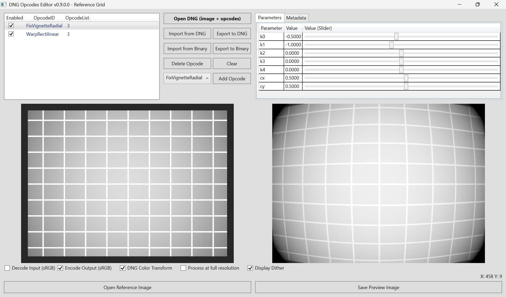

# DNG Opcodes Editor

Read, write, edit and preview DNG opcodes with live feedback.



Adjust any opcode parameter with a slider and watch the preview image update in real time. Import opcodes from a DNG file or a raw `.bin` payload, edit them, then export back to either format.

---

## Features

- **Live preview** of the opcode chain with multi-threaded pixel processing that runs off the UI thread.
- **Full coverage** of OpcodeList1, OpcodeList2 and OpcodeList3 — each opcode remembers the list it belongs to and is written back to the matching tag.
- **No external dependencies** — a built-in TIFF/DNG IFD parser replaces the previous ExifTool requirement.
- **Direct DNG open** for CFA DNGs (Bayer pattern), including Lossless JPEG compressed and tiled layouts, with a built-in bilinear demosaic. LinearRaw DNGs (already demosaiced) and plain RGB TIFFs with LZW or Deflate compression are also supported.
- **Metadata panel** showing the common EXIF / DNG tags of the loaded image (Make, Model, ISO, exposure, DNG-specific colour-calibration tags, etc.).
- **Drag-and-drop** any combination of `.tiff`, `.dng` and `.bin` files onto the window.
- **Per-opcode enable / disable**, gamma encode/decode toggles, and an "Add Opcode" picker.
- **Decoupled Core library** — the WPF window is a thin shell on top of a platform-agnostic core.
- **One-click "Open DNG (image + opcodes)"** — loads the image, clears the current chain, and imports the file's own OpcodeList tags in one go.
- **Full DNG tonal pipeline** — `BlackLevel` + `WhiteLevel` linearisation, EXIF `Orientation`, `AsShotNeutral` white balance, `ColorMatrix` to linear sRGB via the DNG-spec WB diagonal (`Bradford D50→D65`), `BaselineExposure` 2^stops gain, highlight desaturation (kills the magenta cast in clipped highlights), `ProfileHueSatMap`, `ProfileToneCurve`, then **sRGB OETF** (proper piecewise IEC 61966-2-1, not pow 2.2) — all applied automatically. Toggleable per file.
- **FHD preview downsample** — large DNGs (e.g. 24 MP) are downsampled to 1920x1080 before the opcode chain runs, so editing stays responsive. A "Process at full resolution" checkbox bypasses the resize when you need the real output.
- **TPDF-dithered 16→8 display conversion** — no banding in smooth gradients on screen. Toggleable via the "Display Dither" checkbox; saved 16-bit TIFFs are unaffected.
- **Headless CLI** (`dng-opcodes`) for scripting opcode list / extract / inject / metadata / preview operations without the GUI.

## Supported opcodes

| ID | Opcode                  | Read | Write | Preview |
|----|-------------------------|:----:|:-----:|:-------:|
| 1  | WarpRectilinear         |  ✓   |   ✓   |    ✓    |
| 2  | WarpFisheye             |  ✓   |   ✓   |    ✓    |
| 3  | FixVignetteRadial       |  ✓   |   ✓   |    ✓    |
| 4  | FixBadPixelsConstant    |  ✓   |   ✓   |    ✓    |
| 5  | FixBadPixelsList        |  ✓   |   ✓   |    ✓    |
| 6  | TrimBounds              |  ✓   |   ✓   |    ✓    |
| 7  | MapTable                |  ✓   |   ✓   |    ✓    |
| 8  | MapPolynomial           |  ✓   |   ✓   |    ✓    |
| 9  | GainMap                 |  ✓   |   ✓   |    ✓    |
| 10 | DeltaPerRow             |  ✓   |   ✓   |    ✓    |
| 11 | DeltaPerColumn          |  ✓   |   ✓   |    ✓    |
| 12 | ScalePerRow             |  ✓   |   ✓   |    ✓    |
| 13 | ScalePerColumn          |  ✓   |   ✓   |    ✓    |
| 14 | WarpRectilinear2        |  ✓   |   ✓   |    ✓    |

`WarpRectilinear` and `WarpFisheye` both support multi-plane warps (chromatic-aberration correction) and bicubic resampling. `WarpRectilinear2` (DNG 1.6+) adds odd-power radial terms up to order 14 and an optional reciprocal-radial mode.

`FixBadPixels*` and the region opcodes are designed for raw CFA data; on a demosaiced RGB preview they are approximated.

## Getting started

Requires the [.NET 9 SDK](https://dotnet.microsoft.com/en-us/download/dotnet/9.0) on Windows.

```
git clone <repo>
cd DngOpcodesEditor
dotnet run --project DngOpcodesEditor.csproj
```

Run the test suite with:

```
dotnet test
```

### Headless CLI

The `dng-opcodes` tool exposes the same opcode pipeline without a GUI. After
building:

```
dotnet run --project Cli/DngOpcodesEditor.Cli.csproj -- <command> [args]
```

Available commands:

| Command   | Arguments                                              | Purpose                                                          |
|-----------|--------------------------------------------------------|------------------------------------------------------------------|
| `list`    | `<dng>`                                                | List opcodes in each OpcodeList tag.                             |
| `extract` | `<dng> <list:1\|2\|3> <output.bin>`                    | Save the OpcodeListN payload to a binary file.                   |
| `inject`  | `<dng> <input.bin> <list:1\|2\|3>`                     | Replace OpcodeListN in the DNG (modifies the file in place).     |
| `metadata`| `<file>`                                               | Print common EXIF / DNG tags.                                    |
| `preview` | `<input.dng\|tiff> <list.bin> <output.tiff>`           | Apply an opcode list to an image and write a 16-bit RGB TIFF.    |
|           | `[--decode-input-gamma]`                               | Apply the sRGB EOTF to the input first (use for gamma-encoded TIFF / PNG sources). |
|           | `[--no-encode-gamma]`                                  | Skip the final sRGB OETF (keep the TIFF linear).                 |
|           | `[--raw-colors]`                                       | Skip the DNG colour transform (keep camera-native RGB).          |
|           | `[--max-dimension N]`                                  | Downsample so the longest side fits within N pixels.             |

`list`, `extract`, `inject` and `metadata` work on any TIFF / DNG regardless of
compression (they only touch IFD entries). `preview` understands uncompressed,
Lossless JPEG, LZW and Adobe Deflate / zlib (compression codes 1, 7, 5 and 8 /
32946) image data.

## Project layout

| Project                                 | Purpose                                                                                  |
|-----------------------------------------|------------------------------------------------------------------------------------------|
| `Core/DngOpcodesEditor.Core.csproj`     | Platform-agnostic library: opcode reader/writer, one C# file per opcode under `Core/Opcodes/`, TIFF/DNG IFD parser, Lossless JPEG / LZW / Deflate decoders, bilinear DNG raw demosaicer, colour pipeline (`ColorTransform`, `DngColorInfo`, `DngToneCurve`, `ProfileHueSatMap`), 16-bit RGB TIFF writer. |
| `DngOpcodesEditor.csproj`               | WPF (Windows) GUI front-end.                                                              |
| `Cli/DngOpcodesEditor.Cli.csproj`       | Headless `dng-opcodes` command-line tool.                                                 |
| `Tests/DngOpcodesEditor.Tests.csproj`   | xUnit round-trip, decoder and CLI integration tests.                                      |

## FAQ

### Can I open a DNG image directly?

Yes. The editor includes a built-in CFA reader with bilinear demosaic that handles uncompressed, Lossless JPEG (the most common compression) and tiled DNGs, as well as LinearRaw (already-demosaiced) DNGs.

If you ever hit a compression the reader does not handle, fall back to LibRaw's `dcraw_emu` to develop the file first:

```
dcraw_emu.exe -T -4 -o 0 input.DNG
```

The command produces a demosaiced linear TIFF image (16 bit) that can be opened as a Reference Image.

### Why is the preview too bright or too dark?

Opcodes are designed to work on linear, pre-gamma data. If your reference image is gamma-encoded (most 8-bit TIFFs and PNGs), tick **Decode Input (sRGB)**; leave it unticked for linear input (DNGs are linear). **Encode Output (sRGB)** should normally stay ticked so the preview displays correctly on screen. The curve is the proper IEC 61966-2-1 sRGB transfer function, not a pow-2.2 approximation.

### Why can't I see the preview image I saved?

Make sure your image viewer supports 16-bit TIFF files.

## Notes

- This is not an official DNG tool and may not be fully compliant with the DNG specification.
- `FixVignetteRadial` may require adjusting the strength in some RAW processors (for example Capture One).
- Open an issue if you need an opcode that is not yet implemented.

## Links

- [DNG 1.7.0.0 Specification](https://helpx.adobe.com/camera-raw/digital-negative.html)
- [LibRaw](https://www.libraw.org)
- [Changelog](CHANGELOG.md)
- [Opcode support & test-sample inventory](docs/opcode-support.md)
